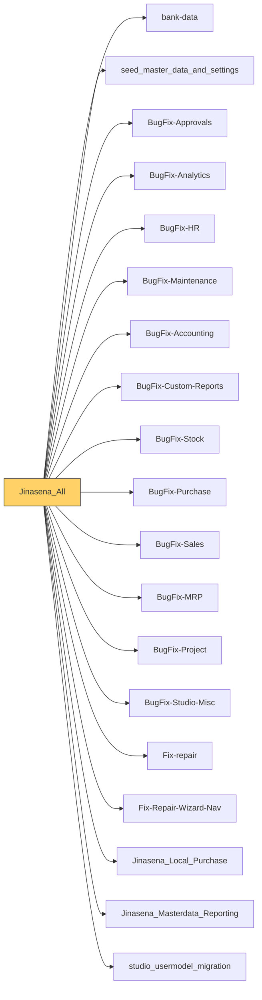

# Functional Documentation — Jinasena_All

> Generated by `scripts/generate_functional_docs.py` from branch `Visual_Migration_02` (commit 763f20a 2026-10-05) and the installed module on the clean environment. For every attribute: **Function** = what it does, **Depends on** = the attributes it relies on (owning module in brackets when it is not this repo), **Used by** = the attributes in any Jinasena repo that rely on it.

| Item | Value |
|---|---|
| Technical name | `Jinasena_All` |
| Title | Jinasena : Meta : ERP |
| Version | `17.0.1.0.44` |
| Category | Extra Tools |
| License | LGPL-3 |
| Installed on environment | installed 17.0.1.0.44 |
| History | [CHANGELOG.md](CHANGELOG.md) |

## Purpose

<!-- SUMMARY:repo -->
Jinasena_All is the meta-module for the Jinasena Odoo 17 ERP. It contains almost no business logic of its own: administrators install this one module to pull in every Jinasena companion module (bank data, master data seed, the BugFix-* repos for Approvals, Analytics, HR, Maintenance, Accounting, Custom Reports, Stock, Purchase, Sales, MRP, Project and Studio-Misc, Fix-repair, Fix-Repair-Wizard-Nav, Local Purchase, Masterdata Reporting, the Studio user-model migration) plus the third-party database backup app, in the right dependency order. It is used by the people who set up and maintain the environments, not by end users.

- Single install point: its manifest depends on all 19 Jinasena repos and auto_database_backup.
- Cascading upgrade: upgrading Jinasena_All from Apps also upgrades every installed module it depends on.
- Studio server-action repair: on install (post_init_hook) and on upgrade to 17.0.1.0.44 it runs BugFix-Studio-Misc's three repair scripts (17.0.0.0.109, 110 and 111), which fix migrated Studio server actions (missing update path, Python value evaluation type, activity responsible user). Because it loads last, the repair covers the actions of every repo, including fresh installs where migration scripts never run.
<!-- /SUMMARY -->

## Module dependencies

| Kind | Modules |
|---|---|
| Odoo standard / enterprise |  |
| Jinasena repos | `bank-data`, `seed_master_data_and_settings`, `BugFix-Approvals`, `BugFix-Analytics`, `BugFix-HR`, `BugFix-Maintenance`, `BugFix-Accounting`, `BugFix-Custom-Reports`, `BugFix-Stock`, `BugFix-Purchase`, `BugFix-Sales`, `BugFix-MRP`, `BugFix-Project`, `BugFix-Studio-Misc`, `Fix-repair`, `Fix-Repair-Wizard-Nav`, `Jinasena_Local_Purchase`, `Jinasena_Masterdata_Reporting`, `studio_usermodel_migration` |
| Third-party apps | `auto_database_backup` |
| Used by (Jinasena repos that depend on this one) |  |

## Contents at a glance

| Attribute type | Count |
|---|---|
| Models extended | 1 |
| Python methods | 3 |
| Install hooks | 2 |
| Migration scripts | 1 |

## Models

| Model | Description | Created / extends | Fields | Views | Actions + automations | Approvals |
|---|---|---|---|---|---|---|
| `ir.module.module` | Module | extends (base) | 0 | 0 | 0 | 0 |

### `ir.module.module` — Module

*Extends a model created by `base`.* Python: `models/ir_module_module.py`.

**Summary:**

<!-- SUMMARY:model:ir.module.module -->
This repo overrides the two Upgrade buttons of the Apps module record. When Jinasena_All is among the modules being upgraded, the helper _jinasena_all_expand adds every installed module listed in its manifest depends, so button_immediate_upgrade upgrades them all in the same run and button_upgrade marks them all for upgrade. For any other module the selection is left unchanged.
<!-- /SUMMARY -->

**Python methods (3):**

| Method | Function | Decorators | Extends standard | Depends on | Used by | Where |
|---|---|---|---|---|---|---|
| `_jinasena_all_expand` | Helper: if the selected modules include the Jinasena_All meta-module, adds every installed module listed in its manifest `depends` to the set; otherwise returns the selection unchanged. Used by the Upgrade button overrides. |  |  |  | `ir.module.module.button_immediate_upgrade()` `ir.module.module.button_upgrade()` | `models/ir_module_module.py:22` |
| `button_immediate_upgrade` | Override of Apps > Upgrade: when Jinasena_All is upgraded, all its installed dependency modules are upgraded immediately in the same run (via `_jinasena_all_expand`). |  | yes | `ir.module.module._jinasena_all_expand()` |  | `models/ir_module_module.py:41` |
| `button_upgrade` | Override of the scheduled-upgrade button: when Jinasena_All is marked for upgrade, all its installed dependency modules are marked for upgrade too (via `_jinasena_all_expand`). |  | yes | `ir.module.module._jinasena_all_expand()` |  | `models/ir_module_module.py:44` |

## Install hooks (`hooks.py`)

Wired in the manifest: post_init_hook → `post_init_hook`.

| Function | Hook | What it does (docstring) | Lines |
|---|---|---|---|
| `repair_studio_server_actions` |  |  | 15 |
| `post_init_hook` | post_init_hook |  | 2 |

## Migration scripts (1)

Run once when the module is upgraded past that version.

| Version | Script | What it does |
|---|---|---|
| `17.0.1.0.44` | `post-migrate.py` | v17.0.1.0.44: run the Studio server-action repairs on databases that already have Jinasena_All installed (see hooks.py). Idempotent. ORM only. |

## Depends on other modules' attributes

Everything of other modules that this repo's attributes rely on. If one of these is removed or changed, this repo is affected.

| Module | Kind | Count | Attributes |
|---|---|---|---|
| `base` | Odoo | 1 | model ir.module.module |

## Used by other repos

This repo's attributes that other Jinasena repos rely on. Changing or removing one of these affects that repo.

_None._
